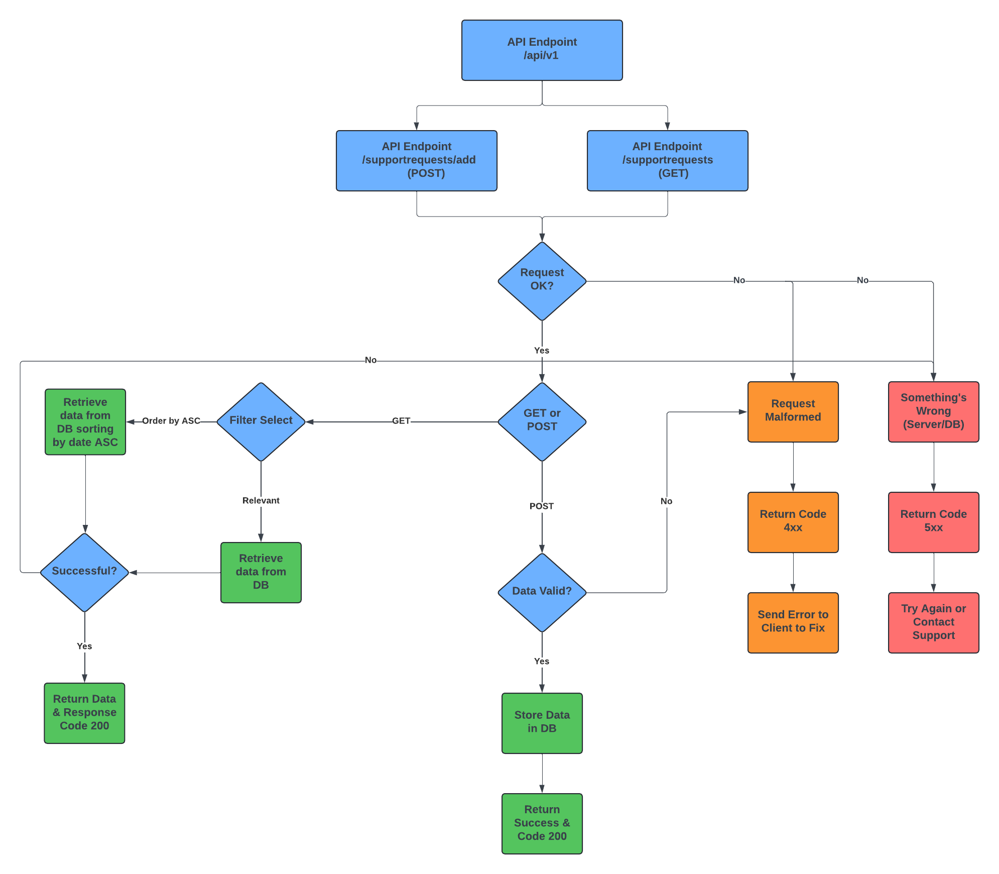

<a name="readme-top"></a>

<br />
<div align="center">
  <a href="https://github.com/trasik/tsrs">
  </a>

  <h3 align="center">Technical Support Request System</h3>

  <p align="center">
    An README file for the application describing plans and structure.
    <br />
    <a href="https://github.com/trasik/trasik98"><strong>Explore the repo »</strong></a>
    <br />
  </p>
</div>

<!-- TABLE OF CONTENTS -->

<details>
  <summary>Table of Contents</summary>
  <ol>
    <li>
      <a href="#about-the-project">About The Project</a>
      <ul>
        <li><a href="#built-with">Built With</a></li>
      </ul>
    </li>
    <li><a href="#installation">Installation</a></li>
    <li><a href="#roadmap">Roadmap</a></li>
    <li><a href="#design">Design</a></li>
    <li><a href="#acknowledgements">Acknowledgements</a></li>
  </ol>
</details>

<!-- ABOUT THE PROJECT -->

## About The Project

This is a simple application that will collect technical support data and list only valid technical support requests.

It will be a full stack application to demonstrate all aspects of data movement.

<p align="right">(<a href="#readme-top">back to top</a>)</p>

### Built With

- [![Java][Java]][Java-url]
- [![Springboot][Springboot]][Springboot-url]
- [![Svelte][Svelte]][Svelte-url]
- [![TailwindCSS][TailwindCSS]][TailwindCSS-url]

<p align="right">(<a href="#readme-top">back to top</a>)</p>

## Installation

### Client Installation/Usage

<p><strong>Prerequisites:</strong> Must have Node.js and NPM installed in order to run</p>

<a href="https://nodejs.org/en/download/prebuilt-installer">Node.js LTS</a>

<p>Verify Node and NPM installation</p>

```
node -v # should print version you downloaded

npm -v # should print the right version for the given node.js environment
```

In Command Prompt/Terminal, navigate to main project folder

```
cd svelte-client
```

```
npm install
```

To run the client, use:

```
npm run dev -- --open
```

### Backend/Server Installation/Usage

<p><strong>Prerequisites:</strong> Must have Java and some sort of JDK installed (Application built/runs with version 22)</p>

<a href="https://www.java.com/en/download/">Java</a>
<br />

If you are using an IDE like IntelliJ, You can let it download and choose which JDK version to use

If you'd like to download the JDK on your computer and choose:

<a href="https://learn.microsoft.com/en-us/java/openjdk/download">Microsoft OpenJDK</a>

#### H2 Database Console

To login into the H2 console navigation to:

```
http://localhost:8080/h2-console

JDBC URL: jdbc:h2:./data/supportdb
User Name: sa
Password: password
```

<p align="right">(<a href="#readme-top">back to top</a>)</p>

## Roadmap

- [x] Plan out how the UI will look (Include pictures)
- [x] Plan out how to API will receive and send data from/to the client (Include pictures)
- [x] Create two pages:
  - [x] Home page
  - [x] List View page
- [x] Validate form data (Requires basic validation may go with HTML5 validation)
- [x] Create the REST API and endpoints
  - [x] Create the model for the support request
  - [x] Use In memory DB as it's a simple application (Use JPA or Hibernate as ORM)
  - [x] Create controller for handling endpoints
  - [x] Although validation happens on frontend also include validation on backend
- [x] Make the UI pretty
- [] Complete documentation

<p align="right">(<a href="#readme-top">back to top</a>)</p>

## Design

### UI Design

#### Home View


#### Home View Completed


#### List View


#### List View Completed


### API Design



<p align="right">(<a href="#readme-top">back to top</a>)</p>

## Acknowledgements

- <a href="https://github.com/svecosystem/mode-watcher">SvelteKit Mode-Watcher</a>
- <a href="https://www.svgrepo.com/">SVG Repo</a>
- <a href="https://unsplash.com/">Unsplash</a>
- <a href="https://www.baeldung.com/spring-mvc-custom-validator">Spring Boot Custom Validator</a>

<p align="right">(<a href="#readme-top">back to top</a>)</p>

[Java]: https://img.shields.io/badge/Java-ED8B00?style=for-the-badge&logo=openjdk&logoColor=white
[Java-url]: https://www.java.com/en/
[Springboot]: https://img.shields.io/badge/SpringBoot-6DB33F?style=flat-square&logo=Spring&logoColor=white
[Springboot-url]: https://spring.io/projects/spring-boot
[Svelte]: https://img.shields.io/static/v1?logo=svelte&label=&message=svelte&&color=white&style=for-the-badge
[Svelte-url]: https://svelte.dev/
[TailwindCSS]: https://img.shields.io/badge/Tailwind_CSS-38B2AC?logo=tailwind-css&logoColor=white
[TailwindCSS-url]: https://tailwindcss.com/
